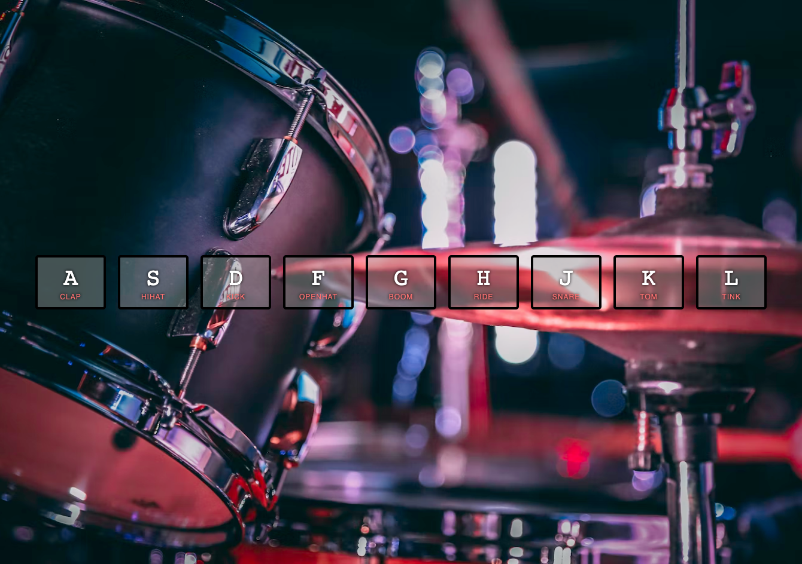

> This is a JavaScript practice with [JavaScript30](https://javascript30.com/) by [Wes Bos](https://github.com/wesbos) without any frameworks, no compilers, no boilerplate, and no libraries.

# 01 - JavaScript Drum Kit

View Demo here -> [Drum Kit Presentation](link)

## How to use
 - click the displayed keys to play the sounds

## Learning notes

 - `keyCode` property to connect the button, check [here](http://keycode.info/)
 - use of the `data-key` attribute for custom element data
 - use of `querySelector` to get a `NodeList` 
 - ES6 `template literals`
 - `transitioned` event

