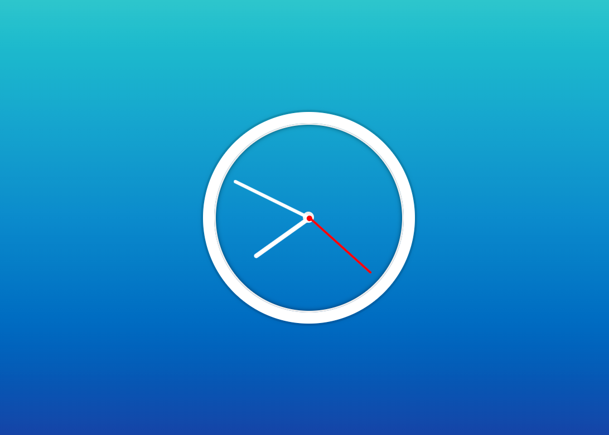

> This is a JavaScript practice with [JavaScript30](https://javascript30.com/) by [Wes Bos](https://github.com/wesbos) without any frameworks, no compilers, no boilerplate, and no libraries.

# 02 - JS + CSS Clock

View Demo here -> [Clock Presentation](link)

## Learning notes

 - `transform-origin` moves the origin of rotation along x-axis
 - `transition-timing-function` is used to create real clock ticking effect
 - use of `setInterval` function to call a `setDate` function every 1000 milliseconds

