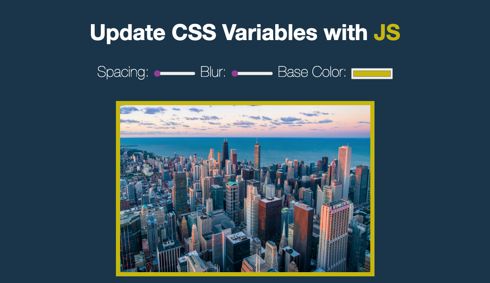

> This is a JavaScript practice with [JavaScript30](https://javascript30.com/) by [Wes Bos](https://github.com/wesbos) without any frameworks, no compilers, no boilerplate, and no libraries.

# 03 - CSS Variables and JS

View Demo here -> [Demo](link)



## How to use
 - select a range to change the image 

## Learning notes

 - `:root` selector to declare CSS variables
 - `dataset` property allows to custom data attributes like `data-xxx` on the element 
 - use of CSS `filter` for `blur`

### Changing CSS property via JS

`document.documentElement` is the root element in JS, so we can change the global CSS variables by JS is just `setProperty` to `style` like so:

```
document.documentElement.style.setProperty('--base', '#000');
```

