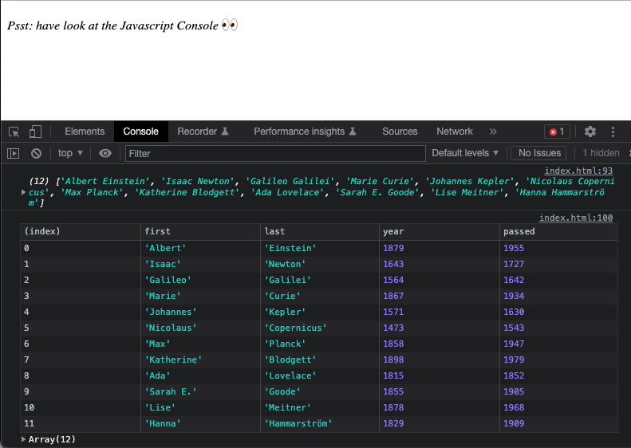

> This is a JavaScript practice with [JavaScript30](https://javascript30.com/) by [Wes Bos](https://github.com/wesbos) without any frameworks, no compilers, no boilerplate, and no libraries.
# 04 - Array Cardio Day 1

View Demo here -> [Array Cardio Presentation](link)

## How to use
 - inspect the page and open the console

## Learning notes
 
 - use `console.table()` instead of `console.log()` to display result as a table
 - `filter()` method returns a new array with all elements that pass the test defined by the given function
 - `map()` method creates a new array with the results of calling the given function for every element in an array and constructs new array from results
 - `sort()` method sorts the elements of an array in place and returns the array
 - combined `filter()` and `map()` methods 
 - `reduce()` method applies a function simultaneously against two values of the array (from left-to-right) as to reduce it to a single value

