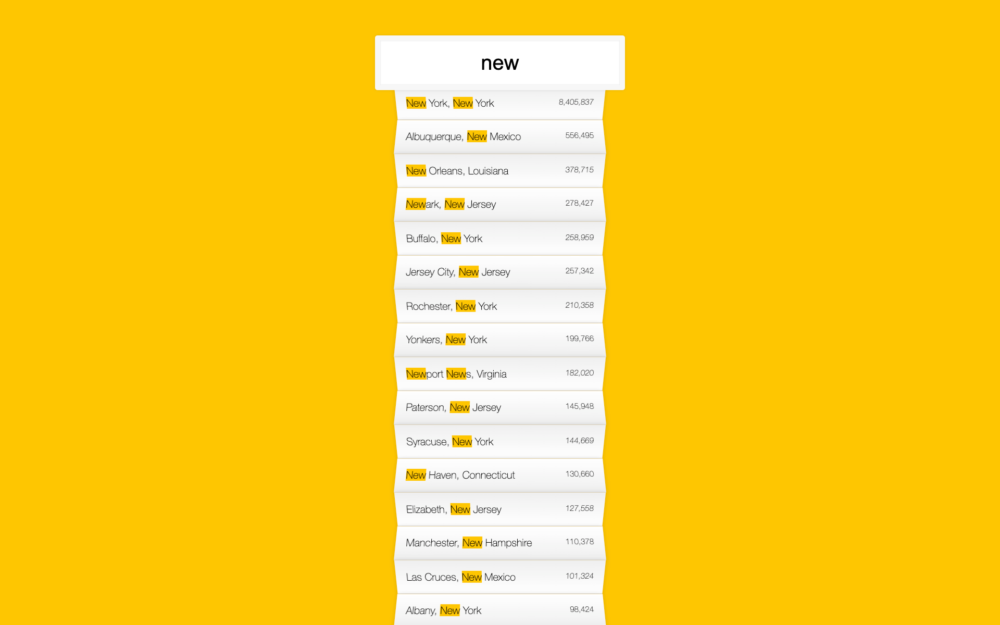

> This is a JavaScript practice with [JavaScript30](https://javascript30.com/) by [Wes Bos](https://github.com/wesbos) without any frameworks, no compilers, no boilerplate, and no libraries.

# 06 - Ajax Type Ahead

View Demo here -> [Ajax Type Ahead](link)



## How to use
 - search for a city or a state name
 - hit enter after search to reset

## Learning notes

 - managing `Promises` with `fetch`
 - `ES6 array spreading`
 - `RegExp` string filter
 - `change` and `keyup` events

 ### RegExp

```
const regex = new RegExp(wordToMatch, 'gi');
```

`g` is for **global** and `i` is for **case insensitive**,
  `wordToMatch` is our variable, then do `element.match(regex)` or `element.replace(regex)`.

in RegExp, the `match()` executes for matching what we search, and then combine with `Array.filter()` so that we can filter out all the results that we exepect.

We use Array.map() and regular expressions to format an array of objects as an HTML string with highlighted search terms, and joins the resulting HTML list items into a single string

```
const html = matchArray.map((place) => {
      const regex = new RegExp(this.value, "gi");
      const cityName = place.city.replace(regex, `<span class="hl">${this.value}</span>`);
      const stateName = place.state.replace(regex, `<span class="hl">${this.value}</span>`);
      if (this.value.length === 0) {
        suggestions.innerHTML = "";
      } else {
        return `
    <li>
        <span class="name">${cityName}, ${stateName}</span>
        <span class="population">${numberWithCommas(place.population)}</span>
    </li>`;
      }
    }).join("");
```